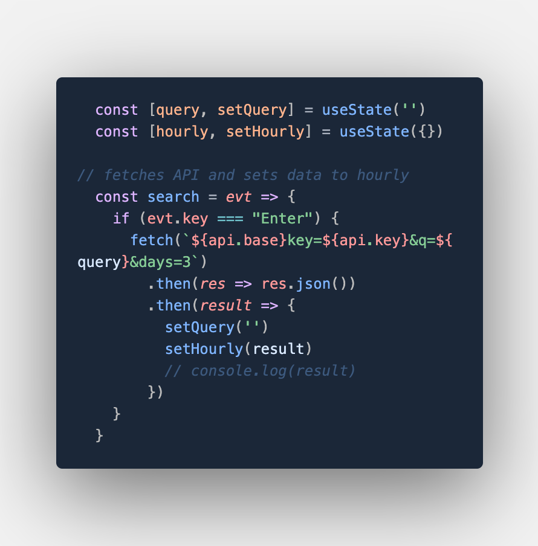
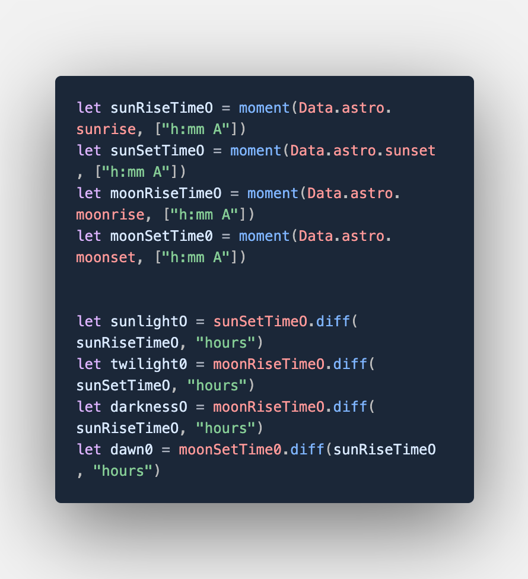
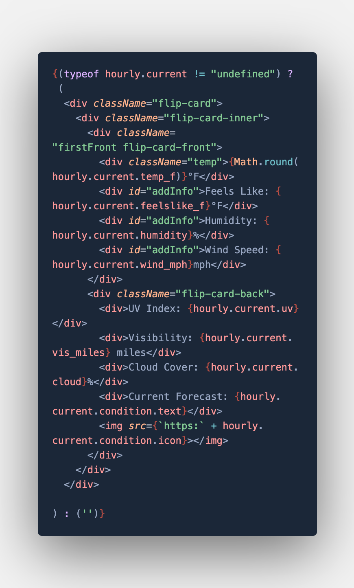

# Hourly Weather App

### This application uses React Library and is designed to give users detailed information about the present, past, and future weather in any city you can think of. 

## Deployed Application:
https://guarded-citadel-48915.herokuapp.com/

## Languages Used:
* Javascript

## Libraries Used:
* React

## Extra:
* Nodejs
* Moment.js
* Bootstrap
* Fetch API

## API Used:
https://openweathermap.org/api/hourly-forecast

## Directions:
1. Search for a city of your choosing.
2. Hover over flipcards to view additional information.
3. Experience viewing a weather application on steroids.

## Screenshots of Code:

## Demo:

